


  

  


## 👋 About Me

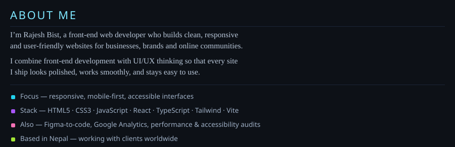

 

## 🛠️ Tech Stack

 


 

## 🚀 Projects

_My live client project — click to open it._

<a href="https://rajesh-dental-care.vercel.app/"></a>

## 🧩 Mini Projects

Nine small front-end builds — plain HTML, CSS and JavaScript. No frameworks.

<table align="center" width="100%" border="0" cellspacing="0" cellpadding="2">
  <tr>
    <td width="33.3%" align="center">
      <a href="https://rajeshxt7.github.io/mini-projects/tip-calculator.html"></a>
    </td>
    <td width="33.3%" align="center">
      <a href="https://rajeshxt7.github.io/mini-projects/todo-list.html">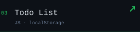</a>
    </td>
    <td width="33.3%" align="center">
      <a href="https://rajeshxt7.github.io/mini-projects/password-generator.html">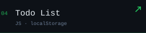</a>
    </td>
  </tr>
  <tr>
    <td width="33.3%" align="center">
      <a href="https://rajeshxt7.github.io/mini-projects/color-palette.html"></a>
    </td>
    <td width="33.3%" align="center">
      <a href="https://rajeshxt7.github.io/mini-projects/pomodoro.html"></a>
    </td>
    <td width="33.3%" align="center">
      <a href="https://rajeshxt7.github.io/mini-projects/quiz-app.html">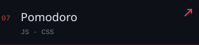</a>
    </td>
  </tr>
  <tr>
    <td width="33.3%" align="center">
      <a href="https://rajeshxt7.github.io/mini-projects/tic-tac-toe.html">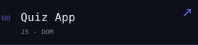</a>
    </td>
    <td width="33.3%" align="center">
      <a href="https://rajeshxt7.github.io/mini-projects/unit-converter.html">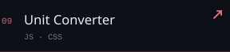</a>
    </td>
    <td width="33.3%" align="center">
      <a href="https://rajeshxt7.github.io/mini-projects/expense-tracker.html">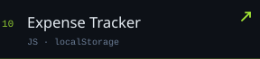</a>
    </td>
  </tr>
</table>

## 📊 By The Numbers

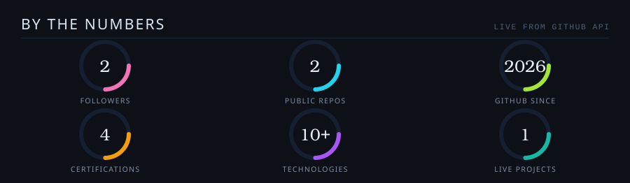

 

## 🏆 Certifications

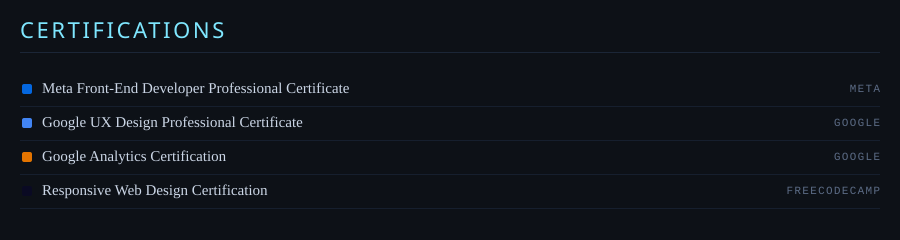

## 🤝 How I Work

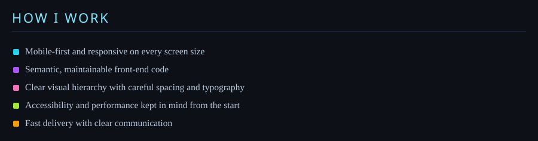

## 🛠️ What I Build

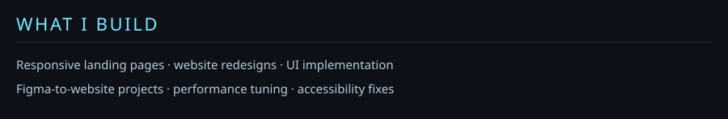

 

<a href="https://www.upwork.com/freelancers/~012441414a81dc8c53"></a>

 

## 📫 Let's Connect

 

 

Built with care and a lot of coffee — Rajesh Bist

